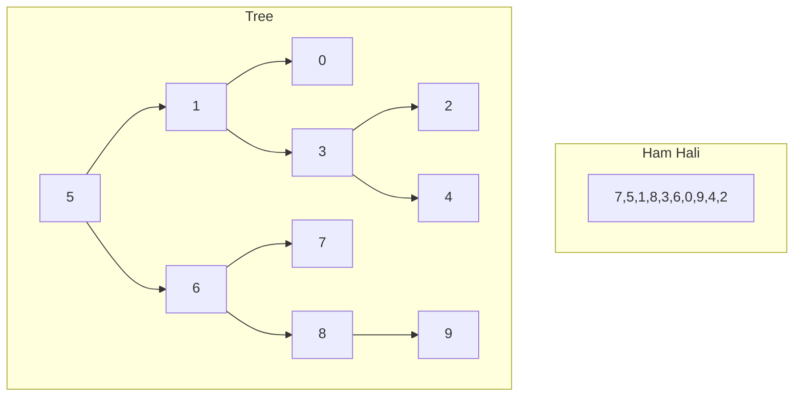
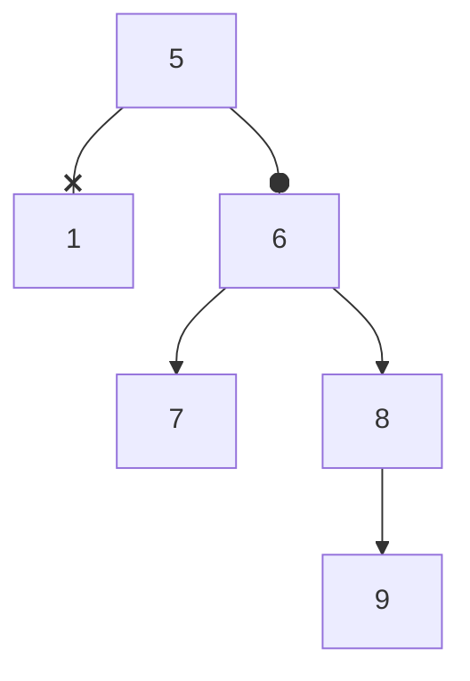
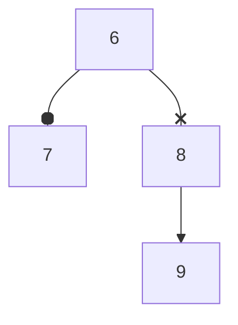

# Binary Search Tree Projesi

```mermaid
flowchart TD
	subgraph Ham Hali
		7,5,1,8,3,6,0,9,4,2
		end
	subgraph Tree
		5-->6
		5-->1
		6-->7
		6-->8
		8-->9
		1-->3
		3-->2
		3-->4
		1-->0
		end
```

---

- n1

```mermaid
flowchart TD
	5--o6
	5--x1
	6-->7
	6-->8
	8-->9
```

-n2

```mermaid
flowchart TD
	6--o7
	6--x8
	8-->9
```

---

Root Point = 5

- n1 Root point right: 6
- n2 Root point left: 7
- end
